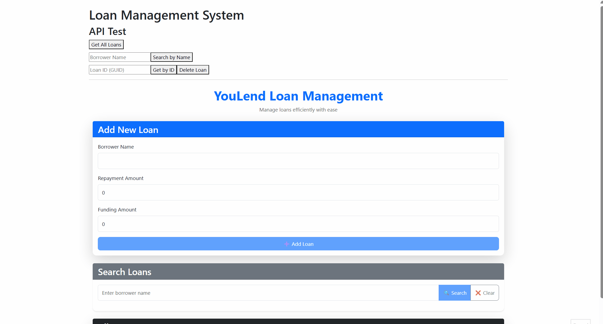

# Loan Management System



## 🚀 Quick Start

### 📥 Clone the repository
```bash
git clone https://github.com/Najiibcodes/youlend-api.git && cd youlend-api
```

⚙️ Deploy Locally
```bash
make up       # Creates Kubernetes cluster and deploys the app
make down     # Tears down the cluster (when done)
```

🔗 **Access**
App: http://loan-system.127.0.0.1.nip.io:8080
Traefik Dashboard: http://traefik.127.0.0.1.nip.io:8080/dashboard

📌 **Project Overview**

**Backend**: .NET 9 API with full CRUD operations.

**Frontend**: Angular-based UI with a loan management interface.

**Infrastructure**: Kubernetes deployment using Helm, Traefik for ingress, and cert-manager for TLS.

🛠️ Tech Stack & Tools
<p align="left">       </p> 
